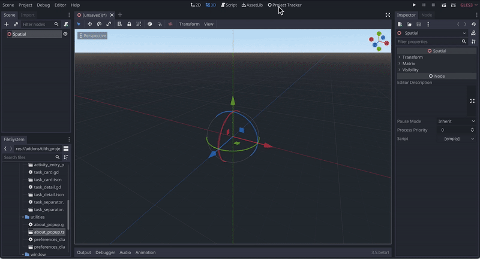

# 🌱Tilth plugin for Godot

## Summary
Tilth studio plugin is an application for planning and tracking tasks to build video games.  
It is being developed as a [standalone application](https://exploregamedev.itch.io/tilth) and as seen here; a plugin for Godot.

This is in the form of a drag and drop [Kanban board](https://en.wikipedia.org/wiki/Kanban_board). With this you can have columns such as **ToDo**, **In progress**, and **Done**.  

Within those columns you create tasks.  You move those tasks from left to right as you start work on them, 
*In Progress*, then once finished, they are moved to *Done*.  The number of stages is configurable, so you can adapt to your specific work style.

## Install

⚠️ *This plugin is in **Alpha**; here to be tinkered with but not used for real work yet.  I have the core functionality, but 
I'm still working through some usability blockers and reliability bugs ([Known issues](https://github.com/exploregamedev/tilth-plugin/issues?q=is%3Aissue+is%3Aopen+label%3Abug)).  I am continuing to work on it though, I feel there are many integration features to explore when running a project tracker inside the editor.  Completely open to collaboration with others.*

---
1. Add the contents of the addon folder in this repo to your Godot projects `res://addons` folder
2. Go to Projects -> Project settings, then the Plugins tab and click enable for the Project tracker plugin

More details can be found [here in the Godot docs](https://docs.godotengine.org/en/stable/tutorials/plugins/editor/installing_plugins.html#installing-a-plugin)

## User guide

Click the *Project tracker* tab to show the project board.  An initial project is created with a single column called backlog.  

You can now create more columns as needed and give them names that align with your specific workflow.

Within the columns (probably starting with the left most), you can start creating tasks.

As you progress on tasks you drag and drop them from left to right as appropriate.

